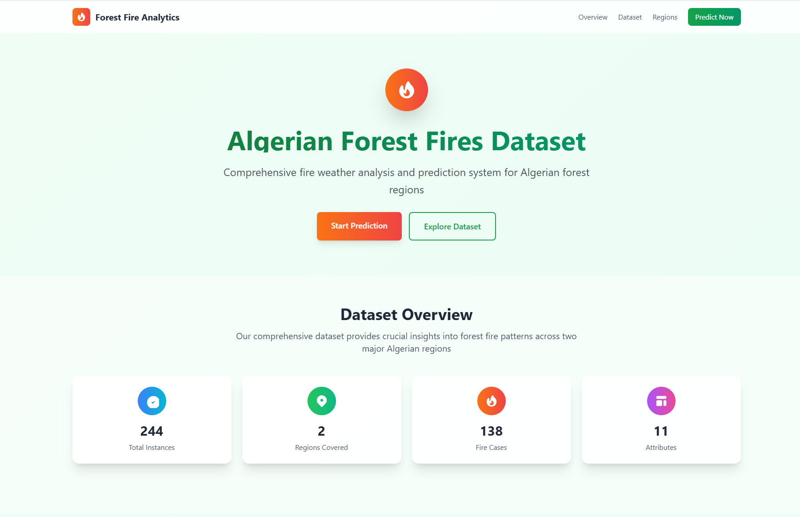
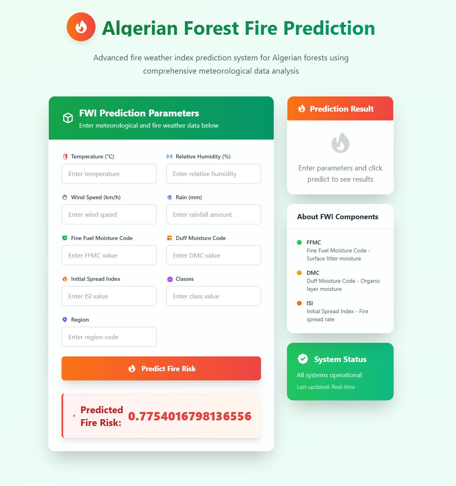
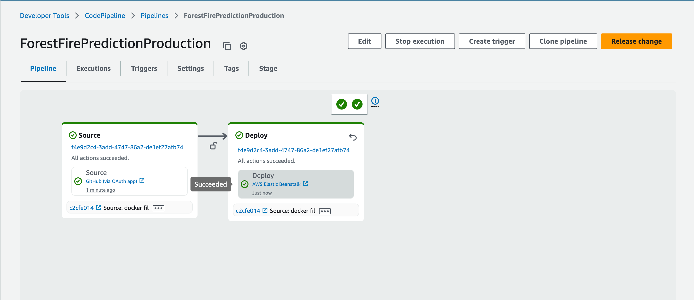

# 🔥 Forest Fire Prediction System

<div align="center">


**A machine learning web application for predicting forest fire occurrence in Algeria using environmental factors**

[Demo](#demo) • [Features](#features) • [Installation](#installation) • [Usage](#usage) • [API](#api) • [Contributing](#contributing)

</div>

## 📋 Overview

This project implements a machine learning-powered web application that predicts forest fire occurrence in two Algerian regions: **Bejaia** (northeast) and **Sidi Bel-abbes** (northwest). The system uses a Ridge Regression model trained on environmental and meteorological data to provide real-time fire risk assessments.

### 🎯 Key Features

- **Real-time Predictions**: Web interface for instant fire risk assessment
- **Scientific Accuracy**: Based on Fire Weather Index (FWI) system components
- **Regional Coverage**: Supports both Bejaia and Sidi Bel-abbes regions
- **Responsive Design**: Modern, mobile-friendly web interface
- **Dockerized Deployment**: Easy containerized deployment
- **REST API**: Programmatic access to predictions

## 🔬 Dataset Information

The model is trained on the **Algerian Forest Fires Dataset** containing:

- **244 instances** across two Algerian regions
- **122 instances per region** (Bejaia and Sidi Bel-abbes)
- **Data period**: June 2012 to September 2012
- **Classification**: Fire (138 instances) vs No Fire (106 instances)

### Input Features

| Feature         | Description                      | Range     |
| --------------- | -------------------------------- | --------- |
| **Temperature** | Maximum daily temperature (°C)   | 22-42     |
| **RH**          | Relative Humidity (%)            | 21-90     |
| **Ws**          | Wind Speed (km/h)                | 6-29      |
| **Rain**        | Daily rainfall (mm)              | 0-16.8    |
| **FFMC**        | Fine Fuel Moisture Code          | 28.6-92.5 |
| **DMC**         | Duff Moisture Code               | 1.1-65.9  |
| **ISI**         | Initial Spread Index             | 0-18.5    |
| **Classes**     | Fire vs No Fire classification   | Binary    |
| **Region**      | Bejaia (0) or Sidi Bel-abbes (1) | Binary    |

## 🚀 Quick Start

### Prerequisites

- Python 3.12+
- pip or Poetry

### Option 1: Using pip

```bash
# Clone the repository
git clone https://github.com/yourusername/ForestFirePrediction.git
cd ForestFirePrediction

# Install dependencies
pip install -r requirements.txt

# Run the application
python application.py
```

### Option 2: Using Poetry

```bash
# Clone the repository
git clone https://github.com/yourusername/ForestFirePrediction.git
cd ForestFirePrediction

# Install dependencies with Poetry
poetry install

# Activate virtual environment
poetry shell

# Run the application
python application.py
```

### Option 3: Using Docker

```bash
# Build the Docker image
docker build -t forest-fire-prediction .

# Run the container
docker run -p 5000:5000 forest-fire-prediction
```

Visit `http://localhost:5000` to access the web interface.

## 💻 Usage

### Web Interface

1. Navigate to the home page
2. Fill in the environmental parameters:
   - Temperature, Humidity, Wind Speed
   - Rainfall amount
   - Fire Weather Index components (FFMC, DMC, ISI)
   - Classification and Region
3. Click "Predict" to get the fire risk assessment

### API Endpoint

```bash
curl -X POST http://localhost:5000/predictdata \
  -H "Content-Type: application/x-www-form-urlencoded" \
  -d "Temperature=35&RH=45&Ws=15&Rain=0&FFMC=85&DMC=25&ISI=8&Classes=1&Region=0"
```

## 📁 Project Structure

```
ForestFirePrediction/
├── application.py          # Main Flask application
├── requirements.txt        # Python dependencies
├── pyproject.toml         # Poetry configuration
├── Dockerfile             # Container configuration
├── models/
│   ├── ridge.pkl          # Trained Ridge Regression model
│   └── scaler.pkl         # Feature scaling model
├── templates/
│   ├── index.html         # Landing page
│   └── home.html          # Prediction interface
├── notebooks/
│   ├── 2.0-EDA And FE Algerian Forest Fires.ipynb
│   ├── 3.0-Model Training.ipynb
│   └── *.csv              # Dataset files
└── images/                # Screenshots and documentation images
```

## 🔧 Technical Details

### Machine Learning Pipeline

1. **Data Preprocessing**: StandardScaler for feature normalization
2. **Model**: Ridge Regression for robust linear prediction
3. **Validation**: Cross-validation on historical fire data
4. **Deployment**: Pickle serialization for model persistence

### Technology Stack

- **Backend**: Flask 3.1.1
- **ML Framework**: scikit-learn 1.7.0
- **Data Processing**: pandas 2.3.0, numpy 2.3.0
- **Frontend**: HTML5, Tailwind CSS
- **Deployment**: Gunicorn, Docker

## 🧪 Model Performance

The Ridge Regression model was selected for its:

- Robustness against multicollinearity
- Good generalization on small datasets
- Interpretability for environmental factors
- Stable predictions across different regions

## 📊 Demo


_Web interface for inputting environmental parameters_


_Real-time prediction results_


_Production deployment on AWS_

## 🤝 Contributing

1. Fork the repository
2. Create a feature branch (`git checkout -b feature/amazing-feature`)
3. Commit your changes (`git commit -m 'Add amazing feature'`)
4. Push to the branch (`git push origin feature/amazing-feature`)
5. Open a Pull Request

## 📄 License

This project is licensed under the MIT License - see the [LICENSE](LICENSE) file for details.

## 🙏 Acknowledgments

- **Dataset**: Algerian Forest Fires Dataset (UCI Machine Learning Repository)
- **FWI System**: Natural Resources Canada Fire Weather Index
- **Regions**: Algeria National Office of Meteorology

## 📞 Contact

**Aaditya Khanal** - [GitHub](https://github.com/ak-codes-py)

Project Link: [https://github.com/yourusername/ForestFirePrediction](https://github.com/yourusername/ForestFirePrediction)

---

<div align="center">
⭐ Star this repository if you found it helpful!
</div>
